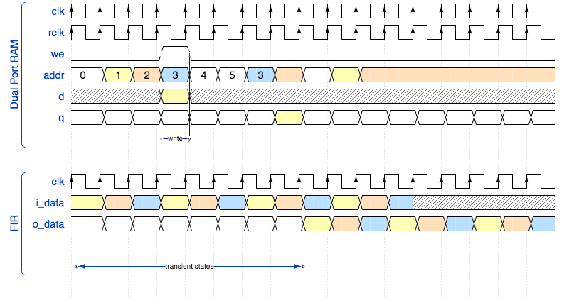

# FIR filter co-processor in FPGA with IPbus protocol

    

## Authors

* [**Rocco Ardino**](https://github.com/RoccoA97) (University of Padua)
* [**Alessandro Lambertini**](https://github.com/Lambe96) (University of Padua)
* [**Alice Pagano**](https://github.com/AlicePagano) (University of Padua)
* [**Michele Puppin**](https://github.com/michelepuppin) (University of Padua)

## Abstract
In this project we implement a FIR filter co-processor in FPGA (**Arty7 xc7a35tcsg324-1**), along with input/output data storage and transfer protocols. In particular, we use the IPbus protocol for communication with the FPGA board and a DPRAM component as memory source. We test the hardware implementation of the filter on several input waveforms and we compare the results with the ones obtained through a Python simulation.

The complete report of this project can be found [**here**](https://github.com/RoccoA97/VHDL_IPBUS_filter/blob/master/report/main/main.pdf)

## Content of the folder
The repository is organized as follows:
* **`src`**: folder with all the source code of the project, in particular:
    * **`firmware`**: all the code for the FPGA firmware;
    * **`software`**: some scripts to access FPGA memory registers through `uhal`;
    * **`analysis`**: some notebooks to write the data to filter and to read the filtered data on FPGA;
* **`report`**: folder with a report of the project, including also the `.tex` source files.
